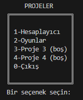
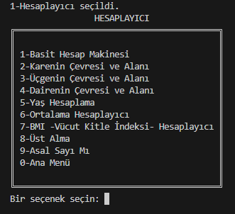
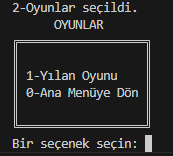
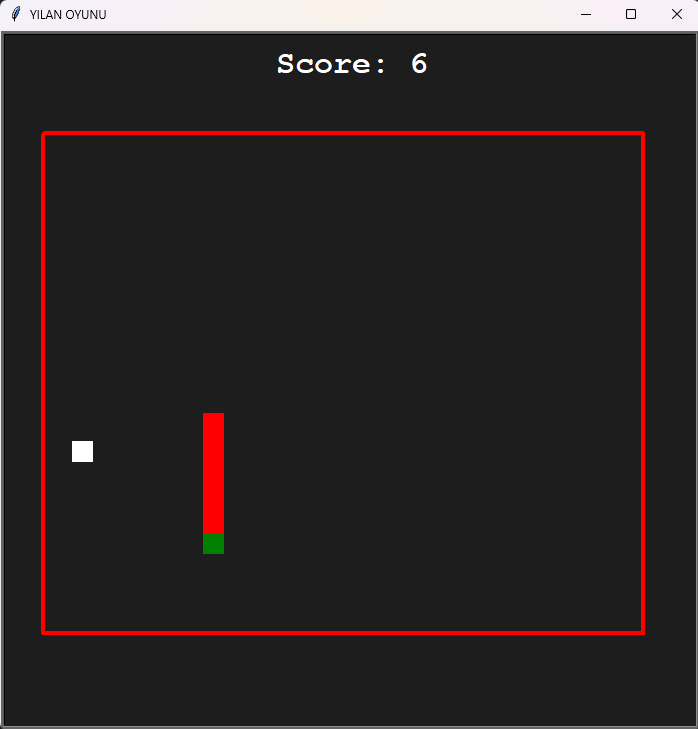

# Proje-1: Python Menü Uygulaması

Bu proje, bir Python menü tabanlı uygulamasıdır. Uygulama, kullanıcıya çeşitli seçenekler sunar ve bu seçeneklere göre hesap makinesi, oyunlar gibi farklı modülleri çalıştırır. Proje, Python'ın temel işlevselliğini ve modüler programlamayı öğrenmek için tasarlanmıştır.

## İçindekiler
- [Kullanılan Teknolojiler](#kullanılan-teknolojiler)
- [Kurulum](#kurulum)
- [Kullanım](#kullanım)
- [Dosya Yapısı](#dosya-yapısı)
- [Fotoğraflar](#fotoğraflar)



## Kullanılan Teknolojiler

- **Python 3.x**: Projenin temel programlama dili.
- **Turtle**: Basit grafikler ve animasyonlar oluşturmak için kullanılır (Yılan Oyunu için).
- **datetime**: Yaş hesaplama gibi zamanla ilgili işlemler için kullanılır.

## Kurulum

Projeyi bilgisayarınıza klonlamak için şu adımları izleyin:

1. Git'i kullanarak projeyi klonlayın:
    ```bash
    git clone https://github.com/OzzyD07/Proje-1
    ```
2. Python 3.x'in bilgisayarınızda kurulu olduğundan emin olun.
3. Gereksinimleri yükleyin:
    ```bash
    pip install -r requirements.txt
    ```
   (Bu proje için ek bir bağımlılık gerekmediğinden, bu dosya boş olabilir.)

## Kullanım

Projeyi çalıştırmak için terminal veya komut satırını kullanarak `main.py` dosyasını çalıştırın:

## Dosya Yapısı
```bash
├── main.py              # Ana menü ve proje yönetimi
├── calculator.py        # Hesaplayıcı modülü
└── games/               # Oyunlar modülü
    ├── games_menu.py    # Oyunlar menüsü
    └── snake_game.py    # Yılan Oyunu
```

## Fotoğraflar



